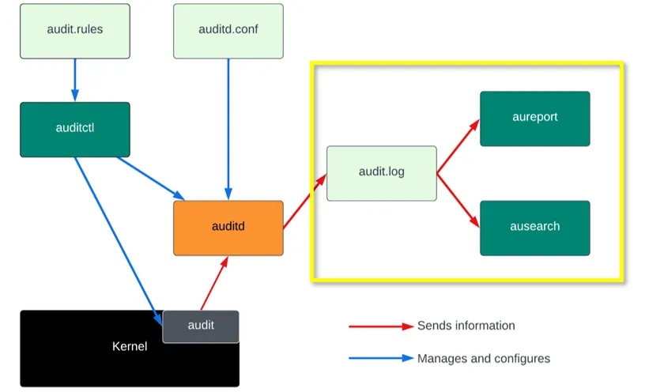

---

marp: true
theme: default
paginate: true
backgroundImage: url(img/background-std-header.png)

---
<!-- Global style -->
<style>
header {
  color: white;
  background-color: black;
  text-align: right;
  font-size: 30px;
  left: 450px;
  height: 50px;
  top: 10px;
  position: absolute;
  
}

img[alt~="center"] {
  display: block;
  margin: 0 auto;
}

h1 {
  text-align: right;
  font-size: 60px;
}

</style>
<!-- Global style -->


# auditd overview # 

---
<!-- _header: 'what are syscalls?' --> 


<!-- Applications cannot directly access hardware or kernel resources -->

Syscalls request privileged operations from the kernel, such as:

- File access (read/write/open)
- Process control (exec/kill)
- Network operations (connect/send/recv)
- Permissions and authentication checks


---
<!--
- auditd auditiert syscalls - what are syscalls?
-->
<!-- _header: 'Overview' --> 


 

<!-- src: https://medium.com/@mansour.mohamedaziz/linux-system-auditing-with-auditd-custom-rules-and-configuration-part-1-330e5a77123a -->


---
<!-- _header: 'Tools Overview' --> 


- auditd — main daemon writing logs
- auditctl — command to manage audit rules dynamically
- augenrules — tool to manage rule files persistently
- ausearch / aureport — tools for searching & reporting audit logs


---
<!-- _header: 'example rule configuration 1' --> 

- Delete `-D`  all rules

```bash 
auditctl -D
```

- watch the path `-w` /tmp/testfile for `-p` writes and save it to `-k` key `testfile_write`

```bash
auditctl -w /tmp/testfile -p w -k testfile_write
```

- watch the path /tmp/testfile for reads and save it to key `testfile_read`

```bash
auditctl -w /tmp/testfile -p r -k testfile_read
```

<!-- wenn regel matched wird rausgesprungen -->

---
<!-- _header: 'example rule configuration 2' --> 

- list all my rules
```bash
auditctl -l
```

- load persistent rules from /etc/audit/rules.d/
```bash
augenrules --load
```

---
<!-- _header: 'cat /var/log/audit/audit.log' --> 

echo "hello_world" > /tmp/testfile

```bash
type=SYSCALL msg=audit(1765282312.834:533): arch=c000003e syscall=257 success=yes exit=3 
  a0=ffffffffffffff9c a1=184eeb0 a2=241 
  a3=1b6 items=2 ppid=32744 pid=32746 auid=1001 uid=0 gid=0 euid=0 suid=0 fsuid=0 
  egid=0 sgid=0 fsgid=0 tty=pts2 ses=25 comm="bash" exe="/usr/bin/bash" key="testfile_write"
type=CWD msg=audit(1765282312.834:533): cwd="/home/ec2-user"
type=PATH msg=audit(1765282312.834:533): item=0 name="/tmp/" inode=101 dev=103:01 
  mode=041777 ouid=0 ogid=0 rdev=00:00 
  nametype=PARENT cap_fp=0000000000000000 cap_fi=0000000000000000 cap_fe=0 cap_fver=0
type=PATH msg=audit(1765282312.834:533): item=1 name="/tmp/testfile" inode=125034 dev=103:01 
  mode=0100644 ouid=0 ogid=0 rdev=00:00 nametype=NORMAL 
  cap_fp=0000000000000000 cap_fi=0000000000000000 cap_fe=0 cap_fver=0
type=PROCTITLE msg=audit(1765282312.834:533): proctitle="/bin/bash"
```

it's written right there! :)

---
<!-- _header: 'better - not optimal..' --> 

ausearch -k testfile_write

```bash
type=PROCTITLE msg=audit(12/09/2025 13:24:04.189:718) : proctitle=/bin/bash
type=PATH msg=audit(12/09/2025 13:24:04.189:718) : item=1 name=/tmp/testfile 
  inode=125034 dev=103:01 
  mode=file,644 ouid=root ogid=root rdev=00:00 
  nametype=NORMAL cap_fp=none cap_fi=none cap_fe=0 cap_fver=0
type=PATH msg=audit(12/09/2025 13:24:04.189:718) : item=0 name=/tmp/ inode=101 
  dev=103:01 mode=dir,sticky,777 ouid=root ogid=root 
  rdev=00:00 nametype=PARENT cap_fp=none cap_fi=none cap_fe=0 cap_fver=0
type=CWD msg=audit(12/09/2025 13:24:04.189:718) : cwd=/home/ec2-user
type=SYSCALL msg=audit(12/09/2025 13:24:04.189:718) : arch=x86_64 syscall=openat success=yes
  exit=3 a0=0xffffffffffffff9c a1=0x1eb7b60 
  a2=O_WRONLY|O_CREAT|O_APPEND a3=0x1b6 items=2 ppid=23876 pid=23878 auid=ec2-user uid=root 
  gid=root euid=root suid=root fsuid=root egid=root sgid=root fsgid=root tty=pts0 
  ses=2 comm=bash exe=/usr/bin/bash key=testfile_write
```

---
<!-- _header: 'Splunk Configuration' --> 

**Splunk_TA_nix**

local/inputs.conf
```
[script://./bin/rlog.sh]
sourcetype = auditd
source = auditd
interval = 30
disabled = 0
```

```bash
...
SEEK_FILE=$SPLUNK_HOME/var/run/splunk/unix_audit_seektime
SEEK_TIME=$(head -1 "$SEEK_FILE")
...
/sbin/ausearch -i -ts $SEEK_TIME -te $CURRENT_TIME -if "$AUDIT_FILE" 2>"$TMP_ERROR_FILTER_FILE" | grep -v "^----"
```

<!-- was passiert wenn splunk mehrere Minuten "nicht da" ist --> 
--- 


# Fragen? # 

